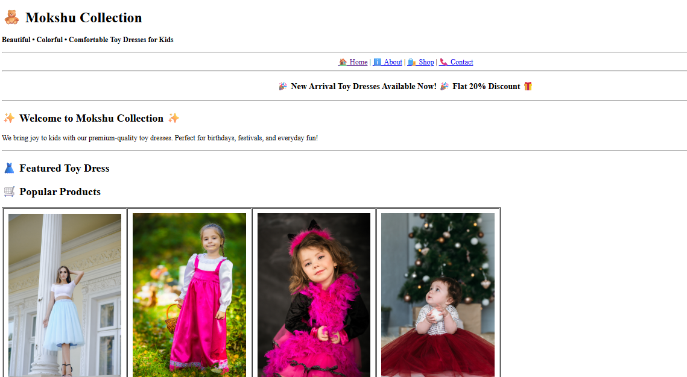

# project-2-mokshu-collection

**Beautiful • Colorful • Comfortable Toy Dresses for Kids**

Mokshu Collection is a multi-page **HTML website** designed for showcasing toy dresses and kids clothing.  
This project is created using **pure HTML** and is ideal for beginners learning web development.

---

## 🌟 Features

- 🏠 Home Page with banner, products, video & reviews  
- ℹ️ About Page with brand story, mission & vision  
- 🛍️ Shop Page with toys, girls & boys clothing  
- 📞 Contact Page with form, map & details  
- 🎥 YouTube video embed  
- 📍 Google Maps embed  
- 🖼️ Product images  
- 💰 Prices shown in INR (₹)

---

## 📁 Project Structure

├── images/
├── pages/
├── index.html
├── README.md

## 🛠️ Technologies Used

- HTML5  
- YouTube Embed  
- Google Maps Embed  

---

## ▶️ How to Run

1. Download or clone the project  
2. Open the folder  
3. Double-click `index.html`  
4. Website opens in browser

---

## 📸 Pages Included

- Home – Featured products, video, reviews  
- About – Brand information  
- Shop – Product tables with prices  
- Contact – Email, phone, map & form  

---

## 📧 Contact Details

- **Email:** mokshucollection@gmail.com  
- **Phone:** +91 98765 43210  
- **Location:** nashik, India  
